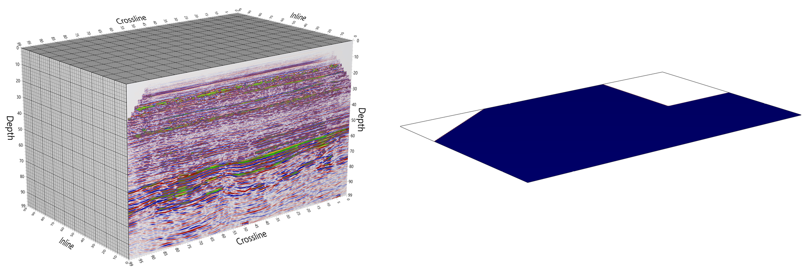
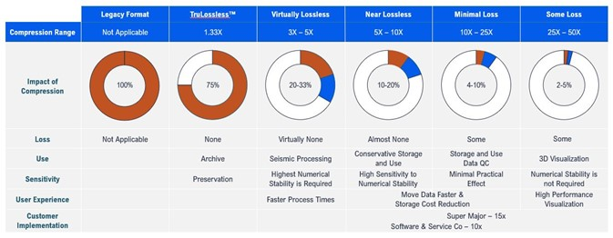
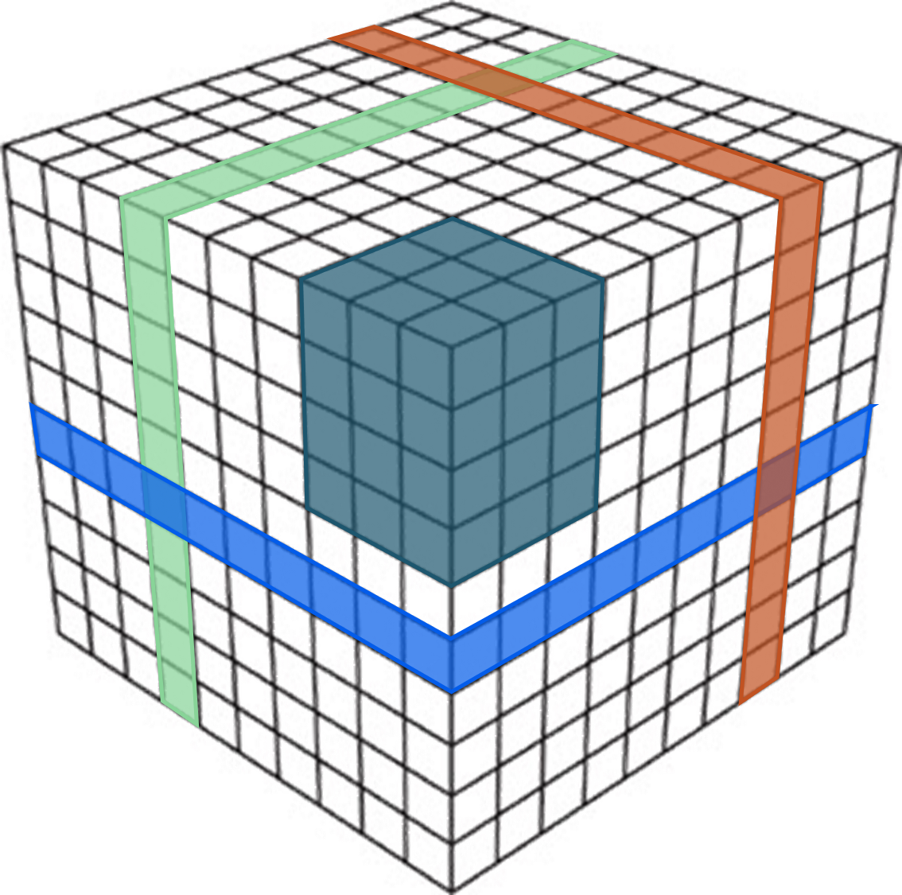
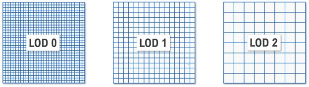
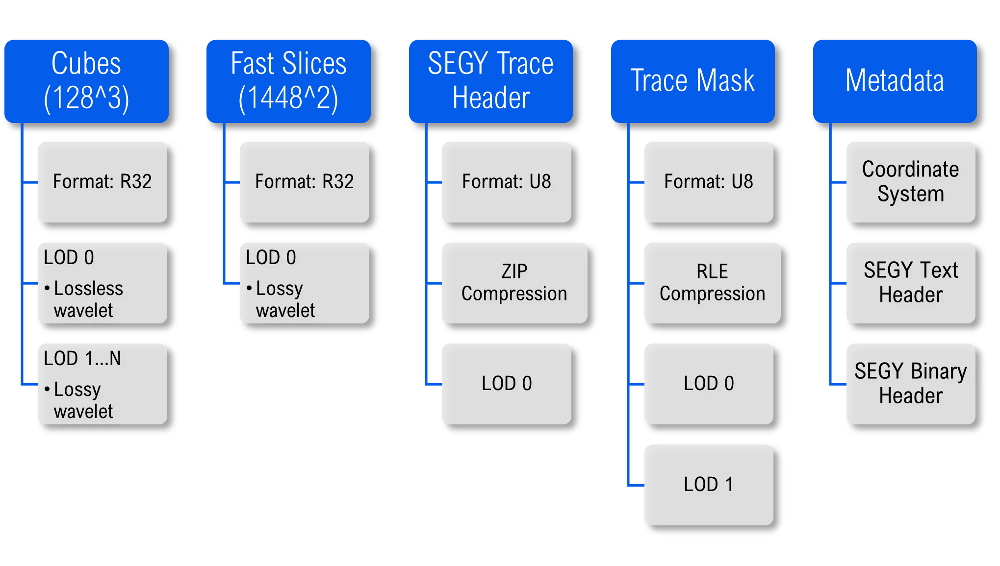

VDS Deep Dive
=============

Introduction
------------

Bluware Volume Data Store (VDS™) is a powerful and flexible storage format for multi-dimensional signal data. It was
conceived more than 15 years ago to overcome the inherent limitations in existing formats. The architecture adopts
concepts developed in the gaming industry where interactive performance is critical. VDS can support previously
unachievable application workflows and end-user experiences.

When importing datasets into VDS, there are several options that can be configured that control the characteristics of
it. This document will describe these options in detail, and provide recommendations for how they should be set.

A specification of the format, called OpenVDS, has been contributed by Bluware to The Open Group OSDU™ Data Platform.
The specification gives the technical details on how a VDS is encoded and stored. The specification is available online
at the OSDU Forum website.

The various options often allow for trading precision or performance versus storage space. For some of the options, it
is also possible to augment an existing VDS.

VDS might either be stored on a cloud object store, such as Amazon S3 or Microsoft Azure Blob Storage, or as a single
file on a traditional file system. The storage backend does not impact which of these options that can be set.

It should be noted that this document describes the possibilities available within VDS itself. The tool used for
importing the data may or may not expose all of these options. For some of the options, it is possible to augment an
existing VDS with more information. This allows for workflows where a high-precision version is stored for archival
purposes in such a way that is consumes as little storage as possible. When the VDS is actively being worked on, it is
augmented so that performance increases.

Implementations
---------------

There are currently three different software development kits (SDKs) that can be used to create applications that read
or write VDS. All three provide similar APIs for reading and writing.

1. **Bluware Engine** is the name for the platform supporting VDS. The underlying SDK is the HueSpace technology
   developed since the early 2000’s. Developers will encounter the HueSpace API and therefore this document will use the
   term HueSpace. The HueSpace SDK is a commercial offering by Bluware which is released  under a commercial license. It
   allows for compressing wavelet data and has GPU accelerated decompression.

2.  **OpenVDS SDK** is released under the open-source Apache 2.0 License and is released in source and binary form. It
    cannot create wavelet compressed VDS.

3. **OpenVDS+ SDK** is a free, but closed source release of OpenVDS which is provide by Bluware. It allows for creating
   wavelet compressed VDS, but it is otherwise identical to OpenVDS.

Channels and Data Type
----------------------

A VDS dataset is defined by a set of axes, each having a name, unit, and number of samples, that determines the
dimensionality (up to 6D) of the VDS, and a set of data channels, each having a name, unit and data format, that
determine which values are stored for each position in the VDS.

There is always at least one channel, the primary channel, and it always has the same dimensionality as the number of
axes of the VDS. The VDS might also have additional channels, these channels can optionally ignore the first axis of the
VDS and instead store a fixed number of values (most commonly a single value). E.g., if the primary channel is 4D, an
additional channel must be 4D or 3D.

The data type of the samples might differ between channels. Supported sample formats are 32- or 64-bit floating point
values, 8-, 16-, 32- or 64-bit integer values, and 2- or 4-component vectors of these formats.

Each channel may be named and have a specified unit of measure. In addition, it is possible to specify a special value
which indicates the absence of a data value; this is called *novalue*.

  An illustration of a VDS with two channels. The primary channel contains a 3D volume of seismic amplitudes. The
  samples are stored as 32-bit floating point values, and the data are partitioned into chunks (thick gridlines). There
  is also a 2D additional channel which indicates if the trace is present or not. The channels may have different data
  type and compression method.

Since VDS allows for both multiple channels as well as multiple components, this gives flexibility in how
multi-component data are stored. For example, if the data are complex numbers, they could either be stored as
2-component data in a single channel, or as two channels: one containing the real and the other containing the imaginary
part.

Recommendations
~~~~~~~~~~~~~~~

- Select a sample format which is as narrow as possible to represent the precision of the sample data. This  will ensure
  that the storage requirements of the data are as low as possible.

- Organize the data in channels based on the expected access patterns. Going back to the example of complex numbers; if
  you know that there will be queries for only the imaginary part they should be in their own channel. This will
  increase performance since less data will have to be read and decompressed during the query.

Compression Format and Quality
------------------------------

Each channel in VDS can be compressed, thereby reducing the storage requirements. Several different compression
algorithms are supported, each suited to a different use case, and each channel in VDS might use a different compression
scheme.

The available compression formats are summarized below:

- **Uncompressed** The data is stored just as they were passed in. This compression scheme bypasses the compression and
  decompression step and is therefore strictly I/O bound.

- **Run-Length-Encoding (RLE)** Lossless encoding where sequences of the same value are stored as a single data value and
  count. This can be very efficient if a channel contains large areas of constant data. Both the compression and
  decompression are very efficient.

- **Zip** Lossless encoding where the data is compressed using the Zlib compression library. This compression is well suited
  for text data, but it is not suited for floating point data. Zip compression is an order of magnitude slower than the
  other methods, and should only be used for data that are mainly stored for round-tripping back to SEG-Y and very
  rarely read.

- **Wavelet** Lossless or lossy encoding using wavelet compression. This compression is well-suited for floating-point data
  that has some smoothness or continuity, while still preserving sharp boundaries.

The compression quality must be specified at runtime when data is imported into VDS. By specifying a low compression
quality, the data will be highly compressed, use little storage space, and artifacts might be introduced. Conversely,
less compression will use more storage space while preserving accuracy.

Wavelet Compression Quality
---------------------------

The table below summarizes the different quality presets for the wavelet compression when creating VDS.

  The table summarizes the different quality presets for the wavelet compression when creating VDS.

Recommendations
~~~~~~~~~~~~~~~

- Use a compression method suited to the specifics of a given data channel.

- For signal data it is recommended to use wavelet compression, with the “Virtually Lossless” preset. Storing at this
  quality gives a significant (3x-5x) reduction in storage size, while still preserving enough of the original data to
  support almost all use cases.

- For preservation of data and restoration back to a binary equal of the source, use TruLossless™ compression.

- Use run-length-encoding for channels with a high number of identical values, such as binary masks that are either zero
  or one.

- Use ZIP compression for data that has no continuity, such as SEGY trace headers.

Fast Slices
-----------

By default, VDS is stored as a bricked format. A data volume is partitioned into smaller bricks, which by default are
128×128×128 samples. When a query is made for a subset of data from VDS, all the bricks contained within the subset must
be read and decompressed. For many types of operations, this is ideal since queries often will contain neighboring
samples. 

However, in some use cases, queries are based on slices through the dataset. In this case, the query will have to read
and decompress many samples that will be discarded. This might reduce performance and increase memory usage. To support
slice-based queries, it is possible to store duplicate copies of the data which is organized into 2D slices. When data
is requested for a slice, it can be read directly, and no data will have to be discarded.

It is possible to specify along which axis additional slices should be stored. If several trace-based queries are made,
it is possible to only store a slice along the depth axis

  A VDS normally stores data as cubes (dark blue), which allows for fast random access of the data. There is an option
  to duplicate the data as 2D-slices (red, green, bright blue) along one or more axes. This allows for very fast
  slice-based access.

The downside to storing slices, is that they greatly increase the storage requirements of the data. Each slice amounts
to storing an additional copy of the bulk data, so VDS containing both bricks, in-lines, cross-lines and time-slices
will be four-times as large as VDS that only contains bricks. When combined with compression, the resultant VDS with
fast slices may ultimately be smaller than the original data.

Recommendations
~~~~~~~~~~~~~~~

- Store slices when there is an expected use case that will benefit greatly from having the slices available directly.

Level of Detail (LOD)
---------------------

It is possible to store lower-resolution copies of the volume data alongside the full resolution copy. This makes it
possible to get “some” data very quickly, since the lower resolution data are much smaller than the full resolution
data, thereby dramatically reducing IO.

This is particularly useful for visualization purposes, since requesting lower resolution data will minimize the wait
time for the end-user before some data is presented on the screen. If the data is zoomed-out, it might not even be
necessary to load the data at full resolution.

When using HueSpace for visualization, the usage of lower-resolution data is automatic.

Each lower-resolution level has half the number of samples in each axis direction, so for 3D data a lower resolution
level has 1/8th the number of samples as the previous resolution level. We call these lower resolution copies LODs
(level-of-detail), where the full resolution data is called LOD0, the next level is called LOD1 and so forth up to LOD12
which is the maximum level. Each level represents the same spatial region, but at a lower resolution. 

When importing data into VDS, it is possible to specify the number of LODs to be created. If the data is compressed
using wavelet compression, the higher LOD-levels will be compressed at lower quality, thereby reducing the storage
requirements for LODs even further.

  A slice of data is stored at multiple resolutions; each resolution level contains half the number of samples in each
  direction. The full resolution layer is called LOD0, and the next level is called LOD1 and so forth

Recommendations
~~~~~~~~~~~~~~~

- If data is to be used for visualization, we recommend that data is stored with LODs. The number of LOD levels that are
  stored will be dependent on the size of the initial dataset. For processing or archival purposes LODs are not needed. 

- If the VDS will be served through Bluware Fast as a virtual ZGY to be accessed through Petrel, it is required that
  LODs are created. In this case all levels up to the maximum should be created

Brick Size
----------

When creating VDS, it is possible to control the number of samples in each brick (or slice). By default, the size of a
brick is 128×128×128 samples. If the sample format is 32-bit floats, this implies an uncompressed chunk is eight
megabytes, and compressed chunks are significantly smaller than this. This size range works well for most existing
storage architectures.

By setting a larger brick size, fewer I/O requests will have to be made to deliver the same amount of data, but each
request is larger and consumes more memory; conversely a smaller brick size will create more but smaller I/O requests.

If using the HueSpace compute engine to process VDS, the brick size also determines the size of each request that is
processed in the engine. If the processing requests are very memory intensive, or running on a memory constrained
architecture, it might be beneficial to use a smaller brick size.

Recommendations
~~~~~~~~~~~~~~~

- Use a brick size of 64×64×64 when storing uncompressed data, and 128×128×128 when using wavelet compression.
 
- Consider using a smaller brick size if working with memory constrained architectures.

Margin Size
-----------

In each brick, a few of the samples are duplicated between bricks. By duplicating samples, one guarantees that the
higher LODs will have equal values across boundaries. This removes blocking artifacts when visualizing or otherwise
computing on the higher LODs.

Such blocking-artifacts when visualizing a VDS is problematic, as it might be difficult for end-users to discern between
features of the data and the artifact. The extent of this problem might also differ between visualization applications.

The margin is decreased by one sample for each LOD, so a higher margin size guarantees a higher LODs will have equal
values. 

However, margins are values that are duplicated in the dataset, causing a very slight storage increase. 

Recommendations
~~~~~~~~~~~~~~~

- The default is to use a margin of four samples, and our general recommendation is to use this default.

- Decrease the margin size if there is no expectation that LODs will be created, such as if the VDS will only be used
  for SEG-Y roundtripping. This will slightly decrease the storage size.

Metadata
--------
In addition to volumetric data, VDS can contain arbitrary metadata. This metadata can contain data-specific information,
such as units (e.g., meters or feet) and the start and end coordinate of a dimension. This information is used by the
HueSpace compute engine when processing or visualizing VDS.

In addition, it is possible to specify global metadata that pertains to the entire dataset, such as the survey
coordinate system used to position the dataset.

Such global metadata are organized in a hierarchy of named categories, and each category can have arbitrary key-value
pairs of metadata. The keys of the global metadata are always strings, while the value can be string, numeric types
(e.g., 32-bit float, integers), or an arbitrary BLOB (Binary Large Object).

The global metadata does not have any specific meaning in VDS itself; it is up to the application to interpret and use
the metadata in a meaningful way. 

It is possible to add extra global metadata to VDS, to better suit a specific workflow. As an example, it is possible to
add lineage information.

The VDS specification defines certain categories of global metadata that should be present for seismic datasets. The
categories that are part of the OpenVDS specification are:

1. **SurveyCoordinateSystem** which provides for positioning a dataset in a coordinate reference system (CRS).
2. **SEGY** which allows for storing the headers and keys of original SEG-Y data. This makes it possible to export VDS back to a bitwise identical SEG-Y file.
3. **TraceCoordinates** which position a seismic line.
4. **ImportInformation** contains information about the initial import to VDS, such as original file name and the tool used for importing.
   
Recommendations
~~~~~~~~~~~~~~~

 - Be conservative about the size of metadata. Some megabytes are acceptable.

 - Add the categories required by the OpenVDS specification for seismic data.

Example: Anatomy of a VDS
-------------------------

Now that we have explored the different options which can be employed when importing data into VDS, we can see how they
are set for a typical seismic dataset imported from a SEGY survey. This example illustrates how VDS can be used to store
the contents of the SEGY, including sufficient data to make it possible to convert VDS back to SEGY in a bitwise
identical fashion.

For this VDS we have imported three channels including the seismic amplitudes, the SEGY per trace text header and the
trace mask, which indicates if the trace was present or not during conversion. In addition, we have added SEGY text and
a binary header information and stored them as metadata in VDS.

  This figure illustrates how VDS can be used to store the contents of the SEGY, including sufficient data to make it
  possible to convert VDS back to SEGY in a bitwise identical fashion.

The channels in VDS have different data and compression formats. The amplitudes are 32-bit floating point values and
compressed using the lossless wavelet compression. The amplitudes are well-suited for wavelet compression because much
of the data is relatively smooth. We have created high-level LODs to support efficient visualization. The higher level
LODs use lossy wavelet compression so they use very little storage. 

In addition to being stored as bricks, the amplitude values are also duplicated and organized as slices. This allows for
increased performance when querying for per-slice data, be it at a significant increase in storage requirements. These
are again stored using the wavelet compression, which may ultimately offset the duplication.

The SEGY trace header consists of 240 bytes and is compressed using lossless ZIP compression. LODs are not added for the
SEGY trace header.

The trace mask is compressed using run-length-encoding, since it will typically contain many identical values in a row.

Finally, the metadata is stored as part of VDS. This information is not used directly when reading data, but
applications might query and use this information. E.g., the SEGY text header might be displayed to show information
about the survey.

Summary
-------

The following table summarizes the available options for VDS. If an option is augmentable, it is possible to modify this
option after a VDS has been created, without having access to the source dataset.

===================  ======================================================================================================================  ===================================================================================================  ===========
Option               Summary                                                                                                                 Tradeoff                                                                                             Augmentable
===================  ======================================================================================================================  ===================================================================================================  ===========
Compression format   Compression scheme used to reduce the storage requirements of the data. Both lossless and lossy schemes are available.  Precision vs Storage. Wavelet compressed VDS cannot be made with OpenVDS.                            No
Compression quality  Quality setting for wavelet compressed data.                                                                            Precision vs Storage                                                                                 No
Data format	         Data type used to represent data.                                                                                       Precision vs Storage                                                                                 No
Level-of-detail	     Store lower-resolution copies of the bulk data.                                                                         Visualization performance vs Storage. LODs are required when transcoding to ZGY using Bluware FAST.  Yes
Fast Slices	         Duplicate data for faster slice-based access.                                                                           Performance vs Storage                                                                               Yes
Brick Size	         The number of samples in each brick.                                                                                    Number of I/O requests vs request size and memory usage.                                             No
Margin Size	         Number of duplicate samples between each brick.                                                                         Very slight storage size increase vs blocking artifacts when rendering LODs.                         No
Metadata	           Arbitrary information that is part of the VDS.                                                                          Information vs Storage space                                                                         Yes
===================  ======================================================================================================================  ===================================================================================================  ===========
