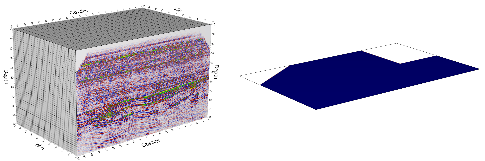
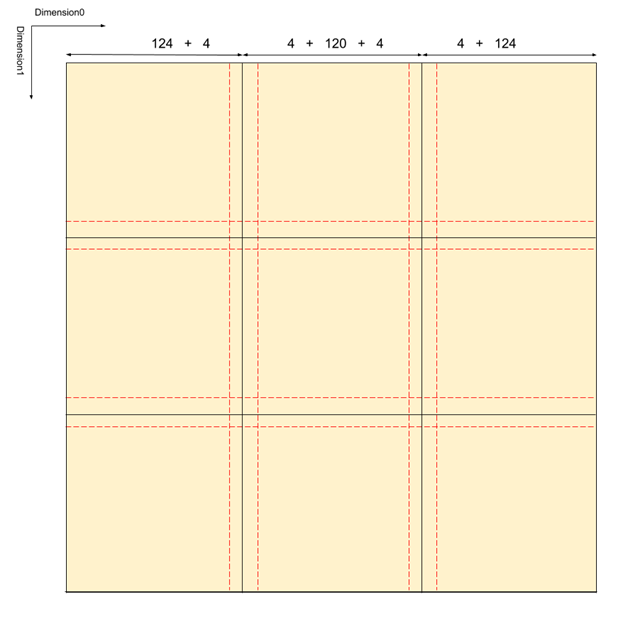

.. _vds_storage_format:

==============
Storage Format
==============

A VDS dataset consists of one or more multi-dimensional volumetric datasets, each such dataset is called a `channel`.
The first channel is called the `primary channel`, and it determines the dimensionality (up to 6D) and number of data
values in each dimension.

The VDS might also have `auxiliary channels`, additional datasets that are part of the VDS. These channels have the
same, or one lower, dimension as the primary channel. E.g., if the primary channel is 4D, an auxiliary channel must be
4D or 3D.

The data in a channel is organized into `layers`, which represents a partitioning of the data into `chunks`. Chunks are
3D bricks or 2D tiles that can be serialized using different compression methods (including no compression) and are
stored as individual objects in the cloud, or in a container file. VDS chunk size and which dimensions are bricked is
arbitrary.

  An illustration of a VDS with two channels. The primary channel contains a 3D volume of seismic amplitudes. The
  samples are stored as 32-bit floating point values, and the data are partitioned into chunks (thick gridlines).
  There is also a 2D auxiliary channel which contains indicates if the trace is present or not.
  The channels may have different data format and compression method.

The VDS formats support several layers per channel, which allows for representing the channel data with different
partitions. E.g., it is possible to store lower resolution versions of the original dataset `LODs` (level-of-detail)
which allows for fast retrieval when less detail is required, e.g. for interactive visualization. It is also possible to
store the original data in several bricking orders, e.g., the data can be stored as both 3D bricks and 2D tiles to allow
for fast access to slices. This will increase the storage requirements.

The format also specifies how `metadata` pertaining to these multi-dimensional arrays of data is stored, both required
metadata and additional optional metadata that can be used to store information that allows re-creating the original
data (e.g. SEG-Y file or other proprietary formats) exactly.

The description of the `partitioning` of the data and all related metadata is encoded in the JSON format (The JSON Data
Interchange Format, 2017), thus it can easily be interpreted using a variety of programming languages and technologies.
Each chunk of data is serialized in one of several available binary serialization methods, all of which have open source
deserialization code available.

.. _figure_layers:

  A 2D example of how bricks are laid out in a layer. In this example FullVCSize is 128 voxels, while both
  PositiveMargin and NegativeMargin are 4 voxels

Layers
------

Each multi-dimensional array of data is called a `layer`, there will be one layer for each partitioning of each LOD of
each data channel in the dataset. The partitioning of a layer into 3D bricks or 2D tiles is done with respect to a
dimension group which defines which dimensions of the multi-dimensional array are the 3 dimensions of the bricks. For
example a 4D array can be partitioned into 3D bricks that are either including the 012 dimensions of the 4D array, or
the 013 dimensions or the 023 dimensions or the 123 dimensions. 

The name of a layer is formed by appending channel name + dimension group + LOD, and for the primary channel of the
dataset the channel name is omitted from the layer name. An example layer name is ``Dimensions_012LOD0`` for the 012
dimension group of the primary channel at LOD 0. See :numref:`figure_layers` for an illustration of how a seismic
poststack dataset is organized. 

Chunks
------

Chunk `data formats` supported include 32- and 64-bit floating point values, 8- and 16-bit unsigned integers with a
scale and offset (which can be used to represent quantized floating-point values), 32- and 64-bit unsigned integers, and
1-bit Boolean values. Null/no-values are fully supported.

Chunks can be uncompressed or compressed with a range of compression options, including wavelet compression (lossy or
lossless), zipped, or run-length encoding. Constant value chunks are marked as such in metadata and do not need to be
stored, so sparse volumes are represented in an efficient way. 

To enable sparse datasets to be efficiently represented, as well as chunk compression methods that can use
adaptive/progressive compression (i.e. use a prefix of the serialized chunk data to produce a lower-quality version of
the chunk), we can have a small amount of extra binary data (typically 8-40 bytes for each chunk) that are available as
a 1D array divided into pages of a fixed number of chunk entries. The interpretation of this metadata is dictated by the
serialization method for the layer in question.